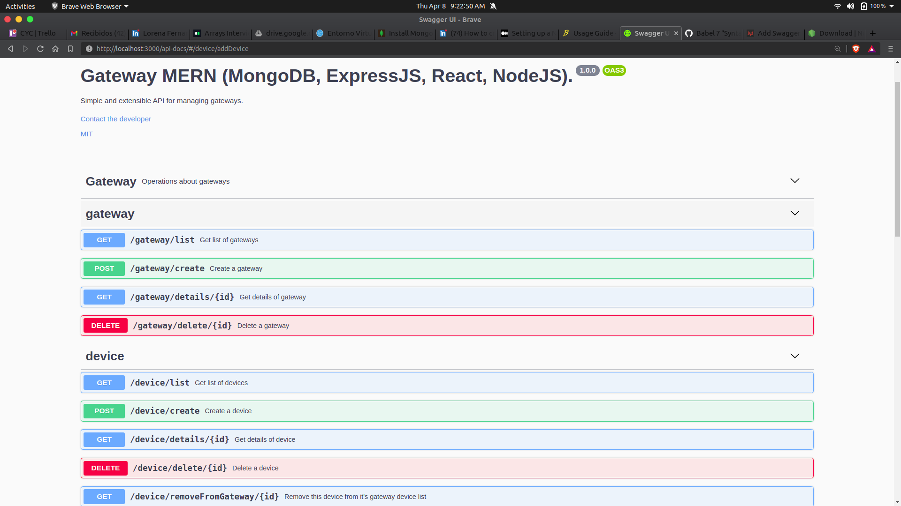

# Installation
## Setup NodeJS
The web API is implemented in NodeJS, so it is necesary to have this
installed. To install Node, follow the platform installation guide
[here](https://nodejs.org/en/download/).

## Setup MongoDB
This app uses MongoDB as it's backend storage. In order to use it we need
to provide a default installation of Mongo and create a new database called
gateway. To install MongoDB, follow the steps described [here](https://docs.mongodb.com/guides/server/install/).

Having MongoDB installed, we need to provide the directory for storing data.

```bash
    $ mkdir -p /data/db
```

or the equivalent in Mac or Windows.

Next we need to execue MongoDB as a service

```bash
    $ sudo systmctl start mongodb.
```

[Here](https://docs.mongodb.com/manual/administration/install-community/) are 
the guides to setup MongoDB service on any platform.

Finally, we access mongod command line and create our database.

```bash
    $ mongo

    MongoDB shell version v4.4.4
    connecting to: mongodb://127.0.0.1:27017/?compressors=disabled&gssapiServiceName=mongodb
    Implicit session: session { "id" : UUID("5bfa2f5f-2f8b-4129-b5e8-22e5b7e44ef7") }
    MongoDB server version: 4.4.4

    > use gateway
```
This steps are only required when first setting up MongoDB.

## Running the server
Running the server is easy, just:

```bash
    $ cd server
    $ npm install
```

These commands installs all the dependencies needed for the server to run, after that, just type:

```bash
    $ node server.js
    MongoDb Initialized
    Expressed Initialized
    Server running on port 3000
```

Once the server is running, we can access http://localhost:3000/api-docs 
where there is a web documentation powered by swagger, where all the API endpoints are listed and can be tested through requests. Also, Postman can be used to test the API too.



## Running the frontend
I shipped a very basic UI to interact with these endpoints. It is build with react and settin it up is as easy as:

```bash
    $ cd frontend
    $ npm install
    $ npm start
```

This will launch a server on port 8000, where we access and find a navigation bar with options for listing and creating Gateways and devices, also, every
table that gets displayed, provides links to the items details and devices options, such as adding and removing devices from the Gateways devices list.

# About the server architecture

The server provided here follows a 3-layer architecture:

CONTROLLER <--> SERVICE <--> DATA ACCESS

These design allows a good decoupling of each component of the server, giving ease when adding a new functionality is required. I make extensive use of 
the IoC pattern, specially Dependency Injection, with the help of awilix library to provide the container. This aproach makes posible to completely abstract the data manipulation from requests routing and responses manipulation. For example, this aproach allows to test the Controllers functionalities using a Mock Repository, instead of working directly with the database. Also, I provide the repository for each service as an interface, and in the container I wire it to each Model (for simplicity), but being an interface means that we can construct a 4-layer architecture based on this repositories and normalize the methods signatures, allowing to use other database engines such as MySQL or SQLServer.

I provide some tests, powered by Jest library, which test for common requirements like:
    
    - Get details of a Gateway
    - Create a new Gateway
    - Fail when trying to create a device and add it to a gateway with already 10 devices.

To run the tests, just type in the server folder:

```bash
    $ npm test
```